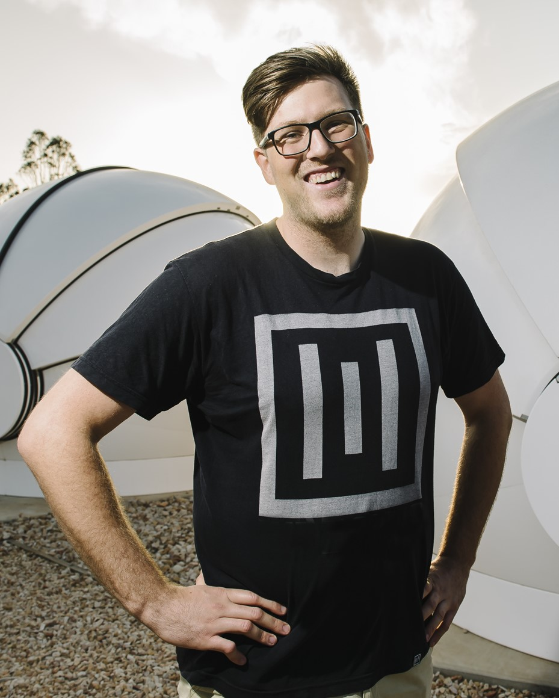
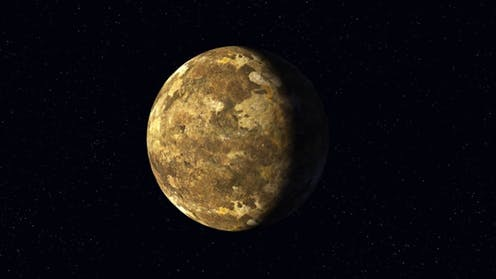
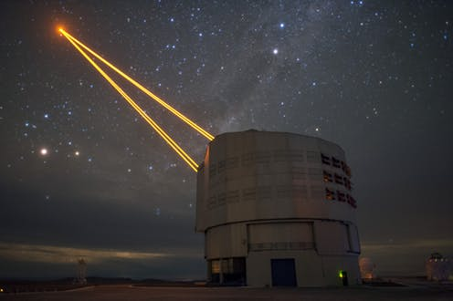
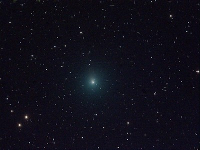

<!DOCTYPE HTML>
<!--
	Astral by HTML5 UP
	html5up.net | @ajlkn
	Free for personal and commercial use under the CCA 3.0 license (html5up.net/license)
-->
<html>
	<head>
		<title>Jake Clark</title>
		<meta charset="utf-8" />
		<meta name="viewport" content="width=device-width, initial-scale=1, user-scalable=no" />
		
		<link rel="icon" type="image/jpg" href="http://cdn.sci-news.com/images/enlarge3/image_4675e-Neptune-Mass-Exoplanet.jpg" />
		
		<link rel="stylesheet" href="assets/css/main.css" />
		<noscript><link rel="stylesheet" href="assets/css/noscript.css" /></noscript>
	</head>
	<body class="is-preload">

		<!-- Wrapper-->
			

				<!-- Nav -->
					<nav id="nav">
						<a href="#" class="icon solid fa-home">Home</a>
						<a href="#research" class="icon solid fa-star-half-alt">Research</a>
						<a href="https://drive.google.com/file/d/1sPvI2k98uUO1S9RI-WmrlW6hMmZtABBj/view?usp=sharing" class="icon solid fa-scroll">CV</a>
						<a href="#outreach" class="icon solid fa-satellite">Outreach</a>
						<a href="#media" class="icon solid fa-photo-video">Media</a>
						<a href="#jake" class="icon solid fa-user-astronaut">About Me</a>
					</nav>

				<!-- Main -->
					

						<!-- Me -->
							<article id="home" class="panel intro">
								<header>
									<h1>Jake Clark</h1>
									
2020 Fulbright Future Scholar   Astronomy PhD Candidate   Freelance Science Communicator

								</header>
								<a href="#research" class="jumplink pic">
									See my reasearch
									
								</a>
							</article>

						<!-- Work -->
							<article id="research" class="panel">
								<header>
									<h2>My Research</h2>
								</header>
								
								
								
I want to try and answer one of humankind's greatest mysteries; Are we alone? My PhD research improves the stellar and planetary characteristics of known and newly discovered planets and the stars that host them. Not only do I want to improve the physical characteristics of these stars and planets, but I also want to know what these planets are actually made out of. Are they made of fairy floss? A whole planet made out of Vegemite? Okay... that's a bit ridiculous, but we can actually detect the amount of rocky material within a host star's atmosphere and then use this as a proxy of the rocky material that these planets could comprise of! From this information, we can make better informed decisions to see if these exoplanets could be terrestrial-like in composition, and thus a better sense of whether life could exist on these alien worlds.  
								
								<iframe width="100%" height="480" src="https://www.youtube.com/embed/aiFD_LBx2nM" frameborder="0" allow="accelerometer; autoplay; encrypted-media; gyroscope; picture-in-picture" allowfullscreen></iframe>  

								As of December 2019, astronomers have discovered over 4,100 exoplanets beyond our solar system. Unfortunately, with the two main methods we use to detect these fascinating worlds, all we tend to see is indirect evidence of a planet. We either see a periodic dip in the host stars' light or light spectrum shift as the planet's gravitational pull tugs on the star. With these two measurements alone, you can roughly determine the geological and chemical composition of rocky terrestrial worlds known as super-Earths or small gassy worlds known as sub-Neptunes. But, what if we could do better than that? What other information can we pull out of these two measurements alone to help us better understand the fundamental structure of these worlds? Well, the gravitational tug method discussed above, known as the Radial Velocity technique, utilises precise measurements of a star’s spectrum. This spectrum encodes the chemical abundances of the star, showcasing the distribution of different materials within it, particularly the amount of planet-building elements like silicon, iron, magnesium and other elements found within a planet hosting star. We can then assume that the star and planets that it hosts were made from the same ginormous gas cloud, and thus we can then use the stellar abundances to then infer the compositions of super-Earths and sub-Neptune worlds! If you'd like to know more about this, I'd highly recommend checking out the works from <a href="https://carolinedorn.ch/">Caroline Dorn</a> and <a href="http://www.caymanunterborn.com">Cayman Unterborn</a>
								

								<h3>Hunting for exoplanets</h3>
								 
								
								<iframe width="100%" height="480" src="https://www.youtube.com/embed/AnX7ExBjrHw" frameborder="0" allow="accelerometer; autoplay; encrypted-media; gyroscope; picture-in-picture" allowfullscreen></iframe>  
								
								
During my PhD, I've been incredibly fortunate assisting in the commissioning of MinERVA-Australis. MinERVA-Australis the Southern Hemisphere's only dedicated observatory assisting in NASA's new planet-finding mission, TESS. <a href="https://www.nasa.gov/tess-transiting-exoplanet-survey-satellite">TESS</a> is a space-based observatory that's scouring the entire night sky for exoplanets. These planets are then confirmed using ground-based observatories such as MinERVA-Australis based in regional Queensland, Australia. Five 0.7 m telescopes at the facility can either work in unison or independently that can either all point at faint targets or observe multiple bright stars all at the same time! Since the commissioning phase, I've been one of the key observers for the project, snaring the discovery of four exoplanets thus far! On top of all of this, I also use the observatory to obtain high-precision chemical abundances of host stars that help me work out what their planets could potentially be made out of.

								<h3>Redefining Known Exoplanetary Systems</h3> 
									
The size and mass of an exoplanet hinge entirely on its host star. When astronomers and astrophysicists alike discover a brand-new world, in most cases we've determined the mass and radius of the exoplanet based upon how big and massive its host star is. In some cases, the fundamental properties stars, including their mass and size can be as large as 100%. That means the size of some stars could big twice as big, or tinier than a pin!! This error than translates back to the planet's properties. We need to accurately determine how large and how massive smaller worlds are, if we have any hope of sending back ET's phone bill. My PhD in part redefines the stellar mass, radius, age of thousands of stars, but I've also assisted in analysing and redefining hundreds of exoplanetary systems discovered by TESS's predecessor, the K2-mission. We've used high resolution spectra from the HERMES spectrograph upon the AAT to precisely determine the mass and radii of planet hosting stars down to an error of 5%!

								
								<h3>Research Affiliations</h3>
								I'm currently a part of several Australian-based exoplanet survey teams including <a href="https://minerva-australis.org">MinERVA-Australis</a>, K2-HERMES, <a href="http://www.physics.usyd.edu.au/tess-hermes/">TESS-HERMES</a> and <a href="https://aat.anu.edu.au/science/instruments/current/veloce/overview">Veloce</a> as well as being a member of the galactic archeology survey <a href="https://galah-survey.org/home">GALAH</a>.
								
								 

								<b>Please feel free to read up on any research that I've worked on <a href="https://ui.adsabs.harvard.edu/search/q=orcid%3A0000-0003-3964-4658&sort=date%20desc%2C%20bibcode%20desc&p_=0">here.</a></b>
								

							</article>
							
						<!-- Outreach -->
							<article id="outreach" class="panel">
								<header>
									<h2>Astronomy Outreach</h2>
								</header>
								
								

								
								<figure>
									
									<figcaption><i>Photo Credit: USQ Photography</i></figcaption>
								</figure> 

								
								I LOVE talking about research as much as conducting it. I was
								
								BUILD A PLANET USQ community groups Channel Nine, Scope, Questacon (Shows)
								
								My PhD research is a huge bag of mixed lollies. It aims to redefine the stellar and planetary characteristics of known and newly discovered exoplanetary systems whilst using the chemical abundances of stars to un-Earth other alien worlds using machine learning techniques.  

								As of June 2019, astronomers have discovered over 4,000 exoplanets beyond our solar system. Unfortunately, with the two main methods we use to detect these fasinating worls, all we tend to see is indirect evidence of a planet. We either see a periodic dip in the host stars' light or light spectrum shift as the planet's gravitational pull tugs on the star. With these two measuremenets alone, you can roughly determine the geological and chemical composition of rocky terrestial worlds known as super-Earths or small gassy worlds known as sub-Neptunes. But, what if we could do better than that? What other information can we pull out of these two measurements alone to help us better understand the fundamental structure of these worlds? Well, the gravitonal tug method discussed above, known as the Radial Velocity technique, utilises precise measurements of a stars spectrum. This spectrum encodes the chemical abundances of the star, showcasing the distrubution of different materials within it. The amount of Silicon, Iron, Magnesium, and other elements found within a planet hosting star and potentially the disc and   

								 

							</article>
							
							
						<!-- Media -->
							<article id="media" class="panel">
								<header>
									<h2>Media Coverage</h2>
								</header>
								
								
								

								
								In my previous life, I founded and coordinated the heavy music radio show <a href="https://www.facebook.com/moshradioadelaide">MOSH</a> at Radio Adelaide, Australia's oldest community radio station. Combining this experience with my Science Circus training, I've become pretty media savvy, yarning on the radio, TV, print and social media about the lastest astromical research across the globe. Below are some of my highlights and is no means an exhaustive list! 
								

								 

								 
							<header><h3>Highlighted Conversation Articles</h3></header>
								
								I've had the absolute pleasure of writing The Conversation is a NGO that aims to bridge the gap between researchers and the boarder community. 
								
								

										
										
											Google’s artificial intelligence finds two new exoplanets missed by human eyes
											
										

										
										
										
											Curious Kids: Why do stars twinkle?
											
										

										
										
										
											We have a Christmas comet: how to spot 2018’s interplanetary bauble
											
										

										
								

								
							<h2>Highlighted Radio Apperances</h2>
							
								

								
									

										Special Guest on 4ZZZ's Natural Reaction
										
									

									
									

									Scientific Commentary on Astronomical and Space Science News during 2SER drivetime
										
									

									
									

										Phenoix Radio
										
									

									
								

							
							
							<h2>Highlighted TV Apperances</h2>
							
							<h2>Highlighted Print Apperances</h2>
							
							
							

						</article>

							
						<!-- Media -->
							<article id="jake" class="panel">
								<header>
									<h2>About Me</h2>
								</header>
								
								

								
								I'm a cool cucumber
								
								 

							</article>

						<!-- Contact 
							<article id="contact" class="panel">
								<header>
									<h2>Contact Me</h2>
								</header>
								<form action="#" method="post">
									

										

											

												<input type="text" name="penis" placeholder="Name" />
											

											

												<input type="text" name="email" placeholder="Email" />
											

											

												<input type="text" name="subject" placeholder="Subject" />
											

											

												<textarea name="message" placeholder="Message" rows="6"></textarea>
											

											

												<input type="submit" value="Send Message" />
											

										

									

								</form>
							</article> -->

					

				<!-- Footer -->
					

					
					<nav id="nav">
						<a href="mailto:jake.clark@usq.edu.au" class="icon soild fa-envelope">email</a>
						<a href="https://twitter.com/spacejayk" class="icon brands fa-twitter">Twitter</a>
						<a href="https://www.instagram.com/spacejayk/" class="icon brands fa-instagram">Instagram</a>
						<a href="https://www.linkedin.com/in/spacejake/" class="icon brands fa-linkedin-in">LinkedIn</a>
						<a href="https://open.spotify.com/playlist/44bcch8jv3JnDsdfcein49?si=hyjoR2FmStSZ3IQaFGXfdA" class="icon brands fa-spotify">Earworms</a>
					</nav>
					
						<ul class="copyright">
							<li>&copy; Untitled.</li><li>Design: <a href="http://html5up.net">HTML5 UP</a></li>
						</ul>
					

			

		<!-- Scripts -->
			
			
			
			
			

	</body>
</html>
